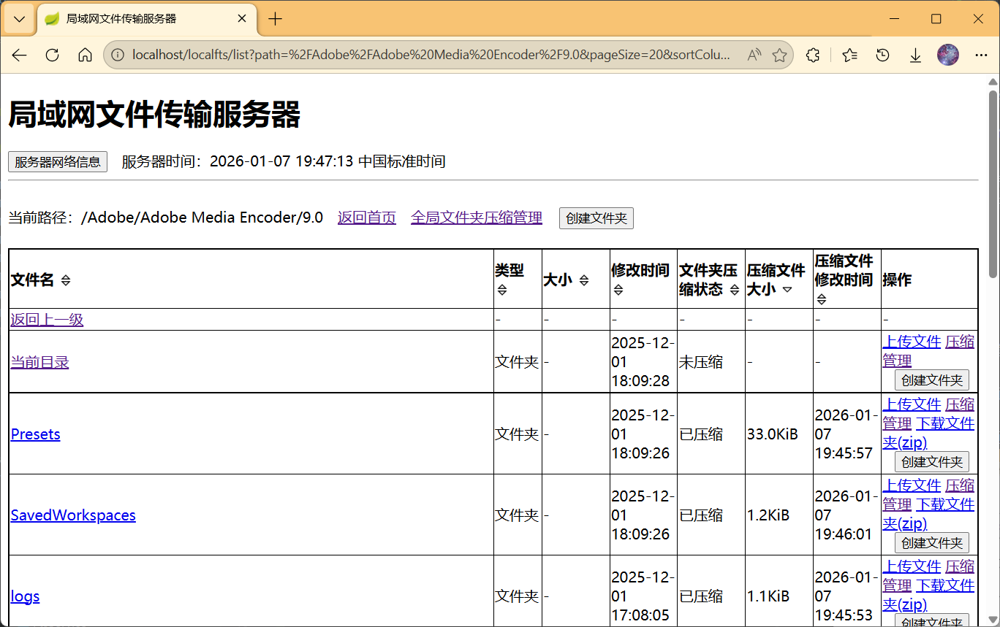
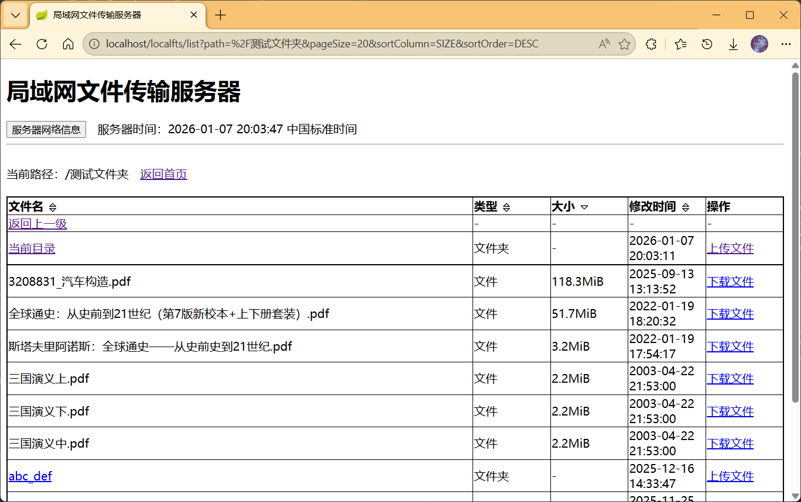
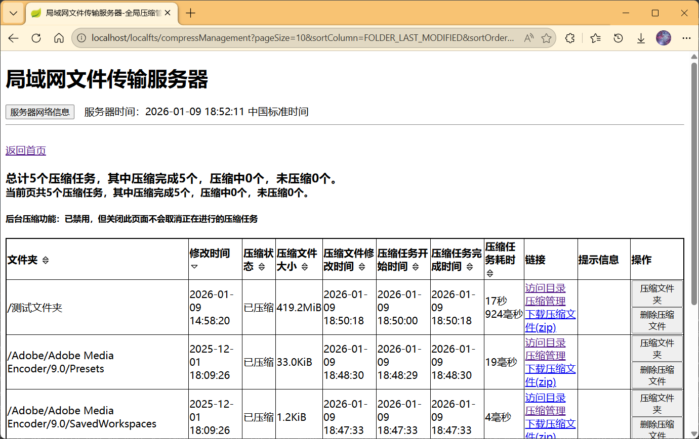
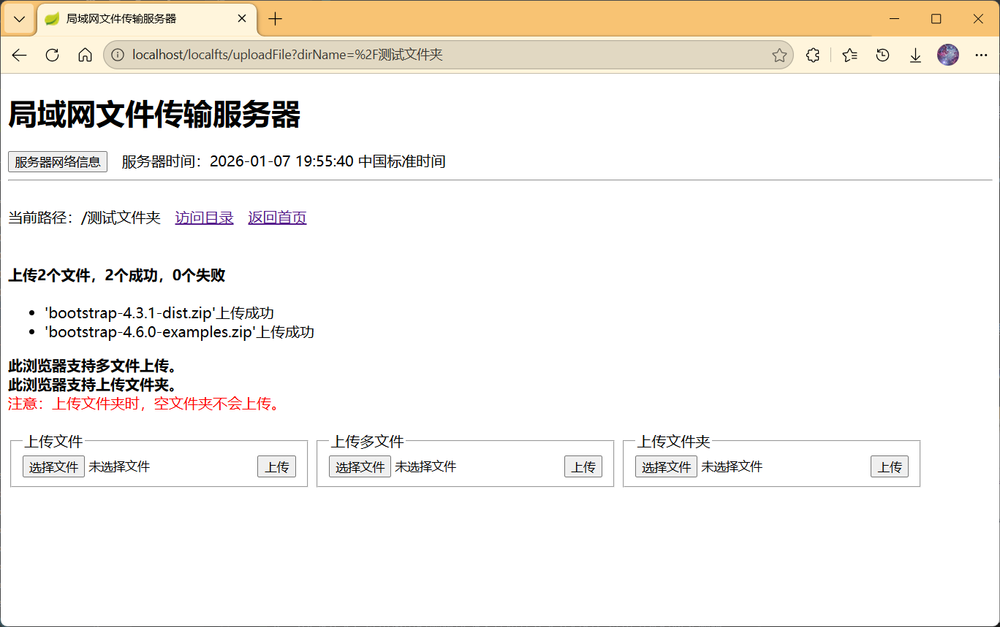
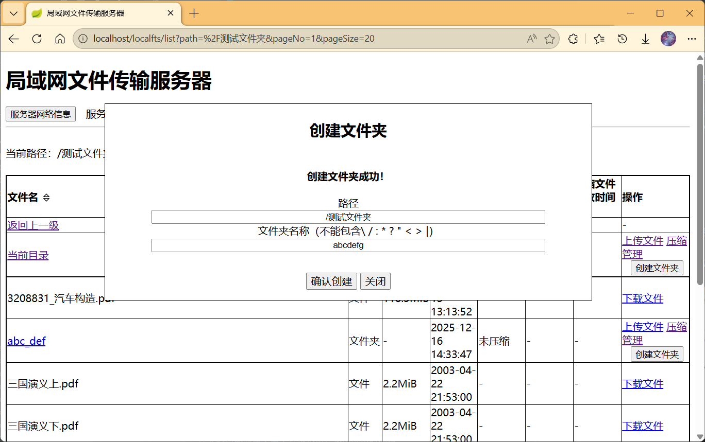

# 适用于网页版客户端的文件传输服务器

----------
适用于网页版客户端的文件传输服务器。

测试用浏览器：
- win10/11 Edge/Chrome
- ubuntu18.04/22.04 Firefox
- win7 IE9、世界之窗浏览器5、qq浏览器、360安全浏览器、Opera浏览器
- winxp IE6、世界之窗浏览器5、qq浏览器、360安全浏览器
- 安卓/iPadOS浏览器

测试操作系统（服务端）：
- Windows xp/7/10/11
- Ubuntu 18.04/22.04

其他操作系统、浏览器暂未发现不适用版本。

下载文件支持迅雷下载、多范围下载。

首次运行提示：可能需要重新指定根路径和端口号（配置说明详见  ）。如：
`java -jar localfts-server-1.0.3.jar --localfts.root_path=D:\Users\Adam --server.port=8080`

注：路径带空格时需要用双引号包裹，如`java
-jar localfts-server-1.1.0.jar --localfts.root_path="C:\Documents and Settings\Administrator\My Documents"`

## v1.1.1
### 功能更新
* 列表页/压缩管理/全局压缩管理页面增加展示压缩文件大小、修改时间
* 压缩管理/全局压缩管理页面增加展示文件夹修改时间、压缩任务开始时间、完成时间、任务耗时
  
* 支持列表页、全局压缩管理页面的排序
  
  禁用压缩功能时的列表页
  
  
* 在受支持的浏览器中支持多文件上传
  
* 支持创建文件夹（功能由`localfts.mkdir.enabled`控制）。文件夹名称长度不得超过200，文件夹全路径名长度不得超过240。
  
### 优化 & 修复
* 优化了列表页的展示，文件和文件夹处于同等地位参加排序，但“返回上一级”“当前目录”置顶(通过加粗边框设置分隔线)不参与排序
* 当压缩开关、应用退出时删除压缩文件路径开关开启时，应用启动创建压缩文件夹时自动创建文本文件提示用户退出应用时删除
* 优化了压缩状态获取条件，不再限制文件夹存在（不存在的文件夹如果进行过压缩也会在压缩页面保留展示，但会给出提示）
* 修复getElementsByName方法
* 当根路径不存在时，默认设置根路径为用户主文件夹
- Windows 11

  Root path 'null' does not match rules, changed to default 'C:\Users\Adam'
- Windows XP

  Root path 'null' does not match rules, changed to default 'C:\Documents and Settings\Administrator'
- Linux

  Root path 'null' does not match rules, changed to default '/home/adam'
  
### 提示
* 当压缩开关、应用退出时删除压缩文件路径开关开启时，应用结束时将会删除压缩文件路径（包括所有由应用创建的文件夹）。如果不希望如此，可通过如下命令强制结束进程：
- Windows

  taskkill -PID &lt;pid&gt; /F
- MacOS/Linux

  kill -9 &lt;pid&gt;
### 已知问题
* 在IE6中对话框渲染存在问题，可能不能很好地居中
* 在桌面Chrome浏览器中点击返回按钮可能不会执行页面刷新，需要手动刷新获取最新状态

## v1.1.0
### 功能更新
* 在受支持的浏览器中支持上传文件夹(Chrome和基于Chromium的浏览器、Opera、Firefox)

  注：上传文件夹时空文件夹会被忽略。
  
* 支持进入压缩页面压缩并下载文件夹(zip)，支持在列表页面下载已经压缩好的文件夹
  
  
* 列表页增加当前目录，压缩状态
* 根据文件夹的压缩状态在浏览器和服务端均有相应的处理
* 配置压缩功能开关(`localfts.zip.enabled`控制)
* 配置压缩文件存储路径(`localfts.zip.path`控制)
* 当应用关闭时自动清理压缩文件所在文件夹(`localfts.zip.delete_on_exit`控制)
* 支持在压缩文件夹前检查文件夹大小是否小于指定值(`localfts.zip.max-folder-size`控制)，若小于则不进行压缩（存在性能问题）
* 后台压缩开关(`localfts.zip.background-enabled`控制)，开启时：允许在退出压缩页面后继续压缩操作，更消耗服务器性能
* 对伪支持上传文件夹的浏览器进行提示(`localfts.upload.directory.pseudo-ua-contains`控制)
* 对不触发页面卸载事件的浏览器进行提示(`localfts.pseudo-unload-ua-contains`控制)
* 支持取消压缩任务、删除压缩文件
* 增加全局压缩管理页面
  
### 优化
* 改进了上传页面，当请求路径不存在时页面给予友好提示
* 列表页面生成可点击链接时不再硬编码，而是根据配置的context-path拼接链接
* 下载文件当文件不存在时跳转到错误页面并展示404状态码
* 支持在退出压缩页面时取消压缩操作，释放服务器资源
* 压缩文件下载链接展示压缩文件大小
* 限制压缩文件存储文件夹的压缩功能
* 添加压缩压缩文件存储路径的特别处理
* 优化对压缩文件存储路径的清理逻辑，当清理开关开启时所有创建的文件夹都会被清理
###  已知问题
* IE9浏览器中获取xhr.status时可能会发生报错"SCRIPT575: 由于出现错误 c00c023f 而导致此项操作无法完成。"可以忽略此问题，可能IE9对xhr的状态处理存在问题，已增加代码做兼容处理，只在开发者工具控制台中有报错，页面无提示。
* 在手机浏览器(EMUI9自带浏览器、Edge)、iPad(Safari、Edge、Chrome、Firefox)打开页面时按返回键返回时可能返回的是已缓存页面，不是实际应重新加载的页面，需要手动刷新查看最新状态。如果保持在浏览器页面部分只通过点击“返回首页”“返回上一级”等链接跳转页面不会遇到此问题。
* 在EMUI9自带浏览器和iPad浏览器(Safari、Edge、Chrome、Firefox)中点击返回时不会触发页面卸载事件(beforeunload)，会导致离开页面时压缩任务仍然会继续进行，即使已经配置禁用后台压缩，需要手动取消。已在压缩管理页面进行提示。
* iPad(iPadOS16.4) Safari/Edge浏览器虽然检测支持文件夹上传，但实际无法选择文件夹。暂时判定苹果系统浏览器(Safari/Edge)均为伪支持浏览器。此情况下仍然展示上传文件夹元素，但给出提示。
* Ubuntu系统使用归档管理器打开zip文件时空文件夹会被隐藏看不到，这是归档管理器的设计使然，但用unzip -l命令可以看到大小为0的空文件夹。

## v1.0.5 代码优化：
- 将所有配置整理到Properties类中，向控制台输出信息的方法整理到Service类中：[LocalFtsProperties.java](src/main/java/com/adam/localfts/webserver/config/localfts/LocalFtsProperties.java),[FtsServerConfigService.java](src/main/java/com/adam/localfts/webserver/service/FtsServerConfigService.java)
- 预留替换Spring Boot jar包中application.yml的方法

## v1.0.4 问题修复 & 功能更新：
- 修复下载文件时文件名由空格变为加号的问题
- 修复中文文件夹上传文件后文件上传成功但是页面报错的问题
- 修复IE6对错误状态码不展示错误页面的问题
- 检查启动选项并输出相关信息
- 支持根路径带空格
- 支持浏览器多线程下载、断点续传
- 展示服务器时间、文件修改时间
  

## v1.0.3 功能更新：
- 增加上传文件功能

## v1.0.1 功能更新：
- 点击服务器网络信息按钮查看服务器网卡信息。
  
- 添加自定义错误页面。
  

## v1.0
提供Web服务展示根路径下的文件列表，提供文件下载功能。
