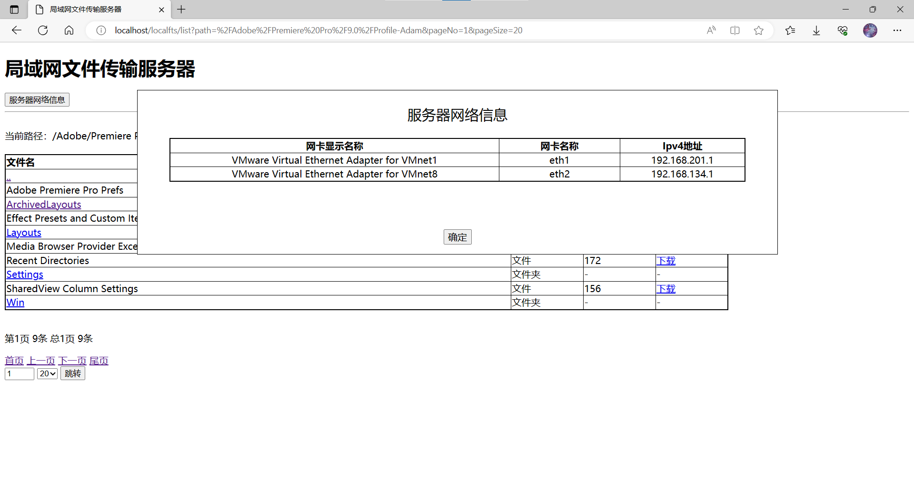
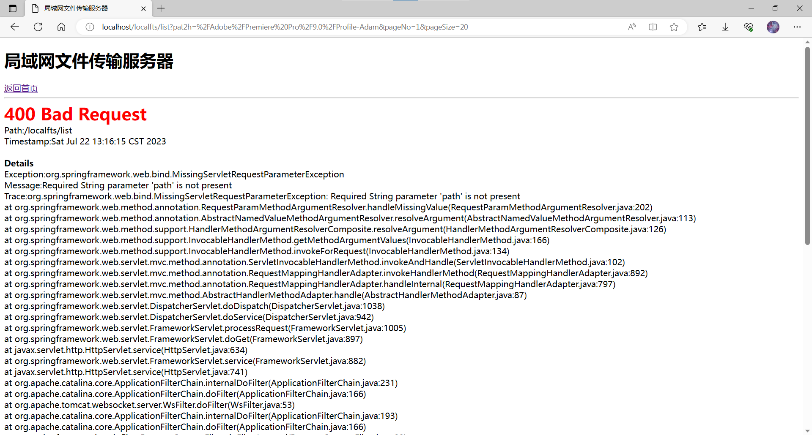
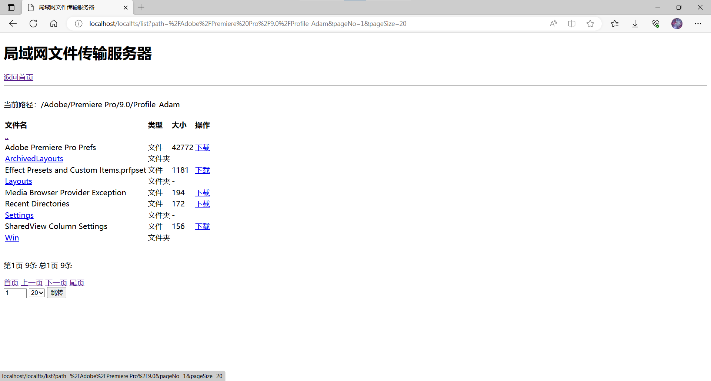

# 适用于网页版客户端的文件传输服务器

----------
适用于网页版客户端的文件传输服务器。
适用浏览器：
- win10 Edge
- win10 Chrome
- ubuntu Mozilla firefox
- win7 ie
- winxp ie

运行release版本时可以通过命令行参数覆盖application.yml配置，如：
java -jar localfts-server-1.0.3.jar --localfts.root_path=D:\Users\Adam

## v1.0.3 功能更新：
- 增加上传文件功能

## v1.0.1 功能更新：
- 点击服务器网络信息按钮查看服务器网卡信息。
  
- 添加自定义错误页面。
  

## v1.0
提供Web服务展示根路径下的文件列表，提供文件下载功能。
